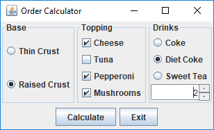
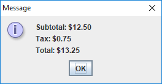

# Programming Project # 6: Pizza Palace
## Project Outcomes:
Develop a Java program that uses:
* Graphical User Interfaces 
* Java Components such as JFrames, JPanels, check boxes, radio buttons and spinners
* Event handlers such as ActionListeners.  

## Preparatory Readings:
Java ZyBook Chapters 1 - 14

## Background Information:
### Project overview:
Create a java graphical program that displays an order menu and bill from a pizza shop.
In this program the design is left up to the programmer however good object oriented design is required.
Below are two images that should be used to assist in development of your program.
Items are selected on the Order Calculator and the message window that displays the subtotal, tax and total is displayed when the Calculate button is pressed.
You can also combine the two functions in the same panel if you wish. 

### Project Requirements:
1. Develop a project that provides the functionality shown in the images above.
2. The type of shop, items offered and cost is up to the designer.  However each item must have a different cost and the final calculation must be correct. 
3. The images display the minimum requirements, however the following is a list of those minimum requirements.
	1. Welcome panel with the shop name and three item panels with panel labels.
	2. At least one set of checkboxes that allows multiple selection and one set of radio buttons that are mutually exclusive.  
	3. A panel that holds the calculate and exit buttons.
	4. A popup box or separate panel that displays the cost of the selections and the tax.
	Note the tax must be calculated after the items are selected.

### Implementation Notes:
1. Create a project that is object oriented, therefore there should be several classes. 
2. Create a UML class diagram that shows all the classes in your project.  
	1. The class diagrams should be created in at multiple iterations.
		1. The first iteration should be done before you code and should provide a design that the code follows.
		2. The second iteration should be completed after the code is complete and should reflex the *exact* class structure of you final program. 
		3. The class diagrams should include 
			1. Access specifier (- or +).
			2. All instance fields with types.
			3. All methods with return type and parameter types. 
			4. Associations, generalization (inheritance), aggregation and multiplicity .
			5. Stereotyping - interface or abstract classes.  
		4. Create a word document explaining the differences and the rational behind the differences between the final result of the two series of iterations.
		A difference is expected as it is extremely difficult to anticipate every design characteristic prior to coding. 
3. Below is an outline of possible structure of the program.
This is a basic outline and does not address all the required details.
You may want to think about your design first before reading the suggested structure below.
	1. Create a separate class for each Panel except the button panel.
	2. Create an Order Calculation class.
		1. Extends JFrame.
		2. Instance fields are objects of the JPanel type.
		3. Adds the JPanels to the JFrame using a BorderLayout
		4. A method to create the button panel (Calculate and Exit)
		5. Two inner ActionListener classes that handle the button actions.
	3. A class that contains the main method and simply creates the Order Calculation object.

### Submission Requirements:
1.	You should turn in:
	1. All your .java files with appropriate comments and javadoc blocks.
	2. The UML class diagram that is used to Design the program. 
	3. The UML class diagram that is completed after the program is finished and exactly reflects your program's class structure.  
	4. A word or other readable document explaining the differences and the rational behind the differences between the final result of the two UML iterations.
	A difference is expected as it is extremely difficult to anticipate every design characteristic prior to coding. 
2. Remember to compile and run your program one last time before you submit it.
If your program will not compile, the graders will not be responsible for trying to test it. 

## Important Notes:
* Projects will be graded on whether they correctly solve the problem, and whether they adhere to good programming practices. 
* Projects must be received by the time specified on the due date. Projects received after that time will get a grade of zero. 
* Please review the academic honesty policy.
Note that viewing another student's solution, whether in whole or in part, is considered academic dishonesty.
Also note that submitting code obtained through the Internet or other sources, whether in whole or in part, is considered academic dishonesty.
All programs submitted will be reviewed for evidence of academic dishonesty, and all violations will be handled accordingly.